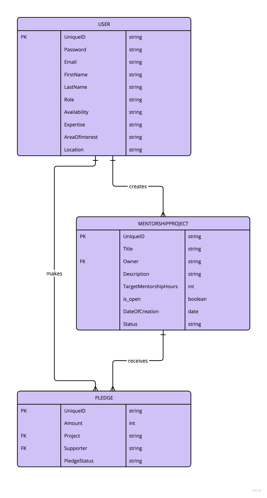

# MentHub: Tech Mentor Matching Platform for Women in STEM

## Project Overview

MentHub is a platform designed to connect women in STEM fields with experienced mentors to foster career growth, knowledge sharing, and professional development. The platform allows mentees to create mentorship projects, which mentors can then support by pledging hours based on their expertise.

This MVP version of MentHub focuses on the core functionality of user profiles (mentor/mentee), creating mentorship projects, pledging mentorship hours, and filtering by expertise and area of interest.

## Key Features

1. **User Profiles**
   - **Mentors** can create profiles outlining their areas of expertise and availability for mentorship.
   - **Mentees** can create profiles to showcase their career goals and the skills they wish to develop.
2. **Mentorship Projects**

   - **Mentees** can create mentorship projects specifying their career goals, skills to develop, and target mentorship hours.
   - **Mentors** can view these projects and pledge hours to help mentees meet their objectives.

3. **Pledge System**

   - Mentors pledge hours to support a mentee's project. A progress tracker shows how many hours have been pledged versus the total target hours for the project.

4. **Basic Search/Filter**

   - Users can search for mentors or projects by expertise or area of interest.

5. **Authentication**
   - Basic sign-up and login functionality for mentors and mentees.

---

## Target Audience/User Stories

1. **Women in STEM**

   - Seeking mentorship and guidance to advance their careers.
   - Looking for project-based support to develop specific skills.

2. **Women Transitioning into STEM**

   - Needing mentorship and advice on how to transition from other fields into STEM.

3. **Mentors**
   - Experienced professionals eager to share their knowledge and mentor others.
   - Willing to pledge hours to support specific mentorship projects.

---

## Front-End Pages/Functionality (Simplified)

1. **Homepage:**

   - Sign-up/Login options.
   - Display mentorship projects with search and filter options based on expertise or project title.

2. **Mentorship Project Details Page:**

   - Shows project description, target hours, and progress.
   - Mentors can pledge hours to a project.

3. **Profile Page:**

   - **Mentor Profiles:** List expertise and availability.
   - **Mentee Profiles:** Share career goals and skills to develop.
   - Users can edit their personal information and manage their mentorship projects or pledges.

4. **Error Handling Page:**
   - **Failed Login Attempts:** Displays a message for invalid email or password ("Invalid email or password. Please try again.") and provides an option to reset the password.
   - **Unauthorized Access:** Shows a message ("You do not have permission to access this page.") if a user tries to access restricted areas.
   - **Invalid Input:** Provides error messages when required fields are missing or incorrectly formatted ("Please fill out all required fields correctly.").

---

## API Specification (Simplified)

| **URL**        | **HTTP Method** | **Purpose**                              | **Request Body** | **Success Response Code** | **Authentication/Authorisation**  |
| -------------- | --------------- | ---------------------------------------- | ---------------- | ------------------------- | --------------------------------- |
| `/mentors/`    | GET             | Returns all mentors                      | N/A              | 200                       | N/A                               |
| `/mentors/`    | POST            | Create a mentor profile                  | Mentor object    | 201                       | Login required                    |
| `/mentees/`    | GET             | Returns all mentees                      | N/A              | 200                       | N/A                               |
| `/mentees/`    | POST            | Create a mentee profile                  | Mentee object    | 201                       | Login required                    |
| `/projects/`   | GET             | Returns all mentorship projects          | N/A              | 200                       | N/A                               |
| `/projects/`   | POST            | Create a new mentorship project          | Project object   | 201                       | Login required / Must be a mentee |
| `/pledges/`    | POST            | Create a new pledge for mentorship hours | Pledge object    | 201                       | Login required / Must be a mentor |
| `/users/login` | POST            | Log in an existing user                  | User object      | 200                       | N/A                               |
| `/users/`      | POST            | Sign up a new user (mentor or mentee)    | User object      | 201                       | N/A                               |

---

## Database Schema (Simplified)

