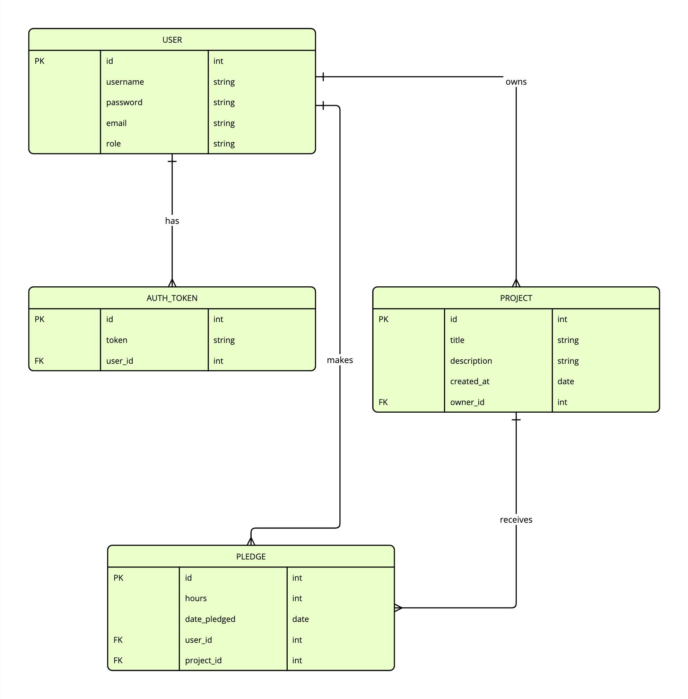

# MentHub: Tech Mentor Matching Platform for Women in STEM

## Project Overview

MentHub is a platform designed to connect women in STEM fields and those transitioning into STEM with experienced mentors. The platform allows mentees to create profiles showcasing their career goals and allows mentors to offer support based on their expertise. The platform fosters career growth, knowledge sharing, and professional development through mentor-mentee relationships.

## Key Features

### User Profiles

- **Mentees**:
  - Create a profile with a bio, industry of interest, and career goals.
  - Display how many hours the mentee has received in mentorship.
- **Mentors**:
  - Create a profile with a bio, industry expertise, and availability for short-term or long-term mentorship.
  - Display how many hours the mentor has provided in mentorship.

### Mentorship Requests

- **Mentees**:
  - After login and profile creation, mentees can view the profiles of mentors and other mentees.
  - Mentees can request to be mentored by a specific mentor. The mentor must accept this request to begin mentorship.
- **Mentors**:
  - After login and profile creation, mentors can view the profiles of mentees and other mentors.
  - Mentors can request to mentor specific mentees, and the mentee must accept the request to begin mentorship.

### Profile Viewing and Privacy

- **Public Profile Viewing**:
  - Anyone (whether logged in or not) can view the basic profiles of mentees and mentors.
  - **Contact details and the option to request mentorship** are restricted to logged-in users only.
  - This allows the platform to showcase profiles and foster connections while ensuring user privacy for important details and actions.

### Authentication

- Basic sign-up and login functionality for both mentors and mentees.
- Once authenticated, users can create and manage their profiles.

### Profile Deletion

- Both mentees and mentors can delete their profiles, but they must be logged in to do so.

## Target Audience/User Stories

- **Women in STEM**: Seeking mentorship and guidance to advance their careers.
- **Women Transitioning into STEM**: Looking for mentors to help navigate the transition from other fields into STEM.
- **Mentors**: Experienced professionals looking to offer guidance, knowledge, and career advice to mentees.

## Front-End Pages/Functionality

1. **Homepage**:
   - Options to sign up or log in as a mentor or mentee.
   - Ability to view profiles of mentors and mentees (without contact details or request options unless logged in).
2. **Profile Pages**:
   - **Mentor Profiles**: Display bio, industry expertise, and mentorship hours given.
   - **Mentee Profiles**: Display bio, industry of interest, career goals, and mentorship hours received.
   - Users can edit or delete their profiles if they are logged in.
3. **Mentorship Request**:
   - Mentees can request mentorship from mentors, and mentors can request to mentor mentees.
   - Once a request is accepted, the mentorship begins.
4. **Error Handling Pages**:
   - Failed login attempts: Displays an error message ("Invalid email or password. Please try again.") and an option to reset the password.
   - Unauthorised access: Shows a message ("You do not have permission to access this page.") if a user tries to access restricted areas.
   - Invalid input: Provides error messages when required fields are missing or incorrectly formatted ("Please fill out all required fields correctly.").

---

## API Specification

| **URL**                | **HTTP Method** | **Purpose**                                       | **Request Body**                               | **Success Response Code** | **Authentication/Authorisation** |
| ---------------------- | --------------- | ------------------------------------------------- | ---------------------------------------------- | ------------------------- | -------------------------------- |
| `/projects/`           | POST            | Create an ad for help                             | Project object (what the user is asking for)   | 201                       | Logged in                        |
| `/projects/`           | GET             | List open projects                                | N/A                                            | 200                       | N/A                              |
| `/projects/<pk>/`      | GET             | Get details on specific ad                        | N/A                                            | 200                       | N/A                              |
| `/projects/<pk>/`      | PUT             | Update the ad description                         | Project object                                 | 200                       | Project owner                    |
| `/projects/<pk>/`      | DELETE          | Delete a project                                  | N/A                                            | 200                       | Project owner                    |
| `/pledges/`            | POST            | Submit mentorship hours (by mentor)               | Pledge object                                  | 201                       | Login required                   |
| `/pledges/<pk>/`       | PUT             | Update a pledge                                   | Pledge object                                  | 200                       | Pledge owner                     |
| `/pledges/<pk>/`       | DELETE          | Delete a pledge                                   | N/A                                            | 200                       | Pledge owner                     |
| `/users/`              | GET             | Returns all users                                 | N/A                                            | 200                       | Superuser                        |
| `/users/<pk>/`         | GET             | Returns the specific details of the user (skills) | N/A                                            | 200                       | Owner of the profile             |
| `/users/<pk>/`         | PUT             | Update the user info                              | User object                                    | 200                       | Owner of the profile             |
| `/users/<pk>/`         | DELETE          | Delete user                                       | N/A                                            | 200                       | Owner of the profile             |
| `/api-auth-token/`     | POST            | Log in an existing user                           | { “username”: username, “password”: password } | 200                       | N/A                              |
| `/users/`              | POST            | Sign up a new user (mentor or mentee)             | User object                                    | 201                       | N/A                              |
| `/users/<pk>/pledges/` | GET             | Returns all the pledges for a specific user       | N/A                                            | 200                       | Owner of the profile             |

---

## Database Schema

---

## Project Requirements

Your crowdfunding project must:

- [ ] Be separated into two distinct projects: an API built using the Django Rest Framework and a website built using React.
- [x] Have a clear target audience.
- [x] Have user accounts. A user should have at least the following attributes:
  - [x] Username
  - [x] Email address
  - [x] Password
- [x] Ability to create a “project” to be crowdfunded which will include at least the following attributes:
  - [x] Title
  - [x] Owner (a user)
  - [x] Description
  - [x] Image
  - [x] Target amount to fundraise
  - [x] Whether it is currently open to accepting new supporters or not
  - [x] When the project was created
- [x] Ability to “pledge” to a project. A pledge should include at least the following attributes:
  - [x] An amount
  - [x] The project the pledge is for
  - [x] The supporter/user (i.e. who created the pledge)
  - [x] Whether the pledge is anonymous or not
  - [x] A comment to go along with the pledge
- [x] Implement suitable update/delete functionality, e.g. should a project owner be allowed to update a project description?
- [x] Implement suitable permissions, e.g. who is allowed to delete a pledge?
- [x] Return the relevant status codes for both successful and unsuccessful requests to the API.
- [x] Handle failed requests gracefully (e.g. you should have a custom 404 page rather than the default error page).
- [x] Use Token Authentication, including an endpoint to obtain a token along with the current user's details.
- [ ] Implement responsive design.

---

## Submission

Please include the following in your README document:

- [x] A link to the deployed [project](https://menthub-3e662e18d026.herokuapp.com/).
- [x] A [screenshot](https://www.canva.com/design/DAGUpC5dtX0/ERgCUOCPBbzXIyX8YnF03A/edit?utm_content=DAGUpC5dtX0&utm_campaign=designshare&utm_medium=link2&utm_source=sharebutton) of Insomnia, demonstrating a successful GET method for any endpoint.
- [x] A [screenshot](https://www.canva.com/design/DAGUpC5dtX0/ERgCUOCPBbzXIyX8YnF03A/edit?utm_content=DAGUpC5dtX0&utm_campaign=designshare&utm_medium=link2&utm_source=sharebutton) of Insomnia, demonstrating a successful POST method for any endpoint.
- [x] A [screenshot](https://www.canva.com/design/DAGUpC5dtX0/ERgCUOCPBbzXIyX8YnF03A/edit?utm_content=DAGUpC5dtX0&utm_campaign=designshare&utm_medium=link2&utm_source=sharebutton) of Insomnia, demonstrating a token being returned.
- [ ] Step-by-step instructions for how to register a new user and create a new project (i.e. endpoints and body data).
- [x] Your refined API specification and Database Schema.
